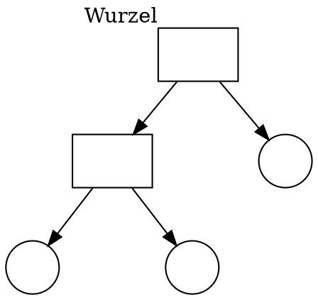
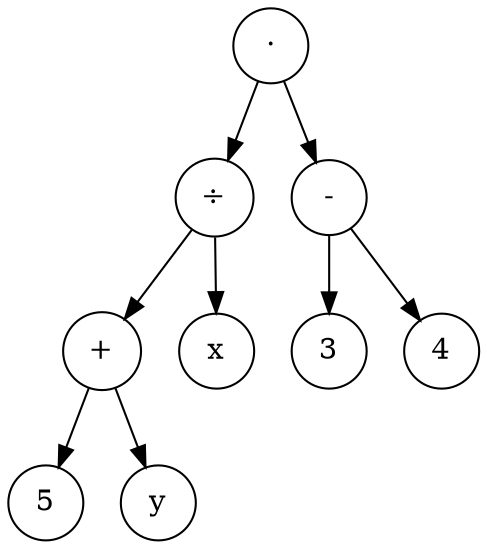

$$
\newcommand{\so}{[\![}
\newcommand{\sc}{]\!]}
\newcommand{\nat}{\mathbb{N}}
\renewcommand{\phi}{\varphi}
$$

## Markdown allgemein
https://demo.codimd.org/features?both

## Formular

$$ \forall x\in M: (x,x)\in R$$

## Proof

**Satz.** Aussage.
**Beweis.** ...

## Backus-Naur-Form

$$ T\ni \varphi,\psi ::= \circ~|~\varphi~\square~\psi $$
$$ \mathcal{L} \ni \varphi,\psi ::= x | \lnot \varphi | \varphi \land \psi | \varphi \lor \psi | \varphi \oplus \psi | \varphi \to \psi | \varphi \leftrightarrow \psi $$
$$ \mathcal{P} \ni \varphi,\psi ::= \top | \bot | P(x_1,\ldots,x_n) | \forall x:\phi | \exists x: \phi | \lnot \varphi | \varphi \land \psi | \varphi \lor \psi | \varphi \oplus \psi | \varphi \to \psi | \varphi \leftrightarrow \psi $$

## Tree

## Syntaxtree

## Semantic

$$
\begin{align}
[\![ n ]\!] &= n &\text{for } n\in\mathbb{N}\\
[\![ \varphi + \psi]\!] &= [\![ \varphi ]\!] + [\![ \psi ]\!]
\end{align}
$$

## Fallunterscheidung

$$ 
\begin{align}
\so \top \sc_b &= w \\
\so \bot \sc_b &= f \\
\so \phi \to \psi \sc_b &= 
    \begin{cases}
        f\quad \text{wenn $\so\phi\sc_b=w$ und $\so\psi\sc_b=f$}  \\
        w\quad \text{sonst}
    \end{cases}
\end{align}
$$

## Text unter Symbolen

$$
\underbrace{\text{Christian ist ein Mann}}_{p} \to \underbrace{\text{Christian hat kurze Haare}}_{q}
$$

## Umformen

$$
\lnot(\phi\to\psi) \overset{Def.}\equiv 
\lnot(\lnot\phi\lor\psi) \overset{De~Morg.}\equiv
\lnot(\lnot\phi)\land\lnot\psi \overset{Neg.}\equiv
\phi\land\lnot\psi
$$

## Schlussregeln

$$
\dfrac{\dfrac{A}{A}\quad \dfrac{A}{A}}{A}
$$

 

$$
\dfrac{\dfrac{\dfrac{\forall x:P(x)\to Q(x)}{P(\dot z)\to Q(\dot z)}\forall:Anw\quad \dfrac{\forall y:P(y)}{P(\dot z)}\forall:Anw}{Q(\dot z)}}{\forall z: Q(z)}
$$

 

$$
\dfrac{\dfrac{\forall x:P(x)\to Q(x)}{P(\dot z)\to Q(\dot z)}\forall:Anw\quad \dfrac{\forall y:P(y)}{P(\dot z)}\forall:Anw}{\dfrac{Q(\dot z)}{\forall z: Q(z)}}
$$